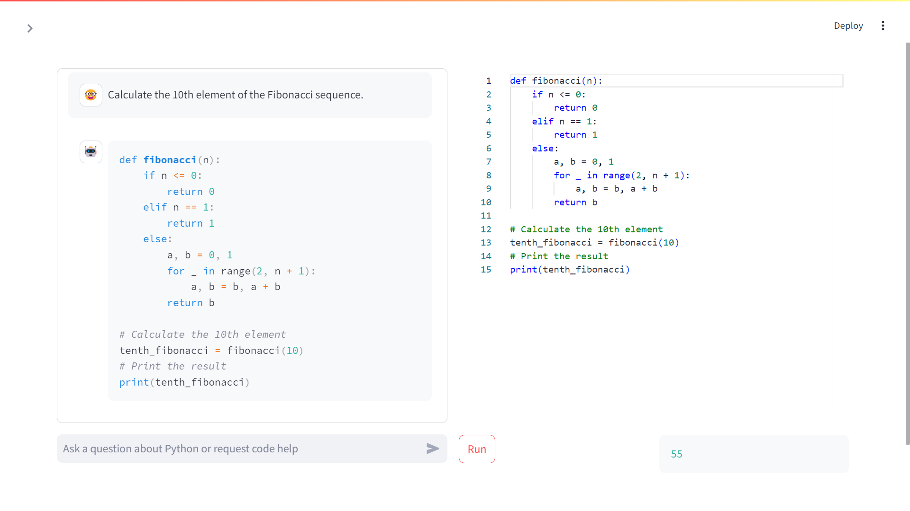

# AI Coding Assistant

This is a simple AI coding assistant that allows you to write and run Python code in the Monaco editor.

**Resources:**
- Claude Artifacts
- ChatGPT Canvas
- [v0](https://v0.dev/) by Vercel
- [Bolt.new](https://bolt.new/)
